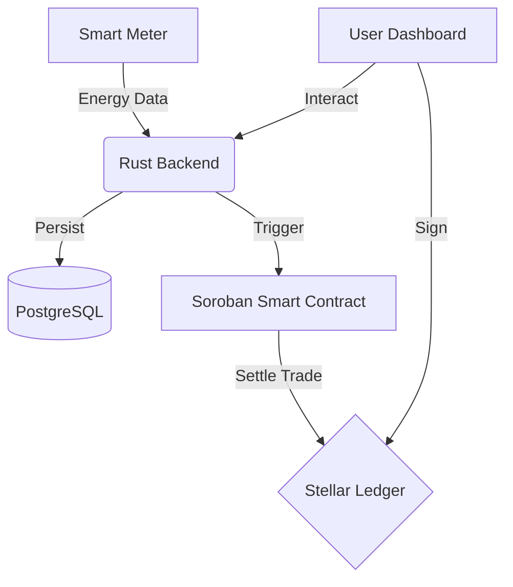

# ⚡ VoltChain

**Empowering community microgrids through blockchain-based energy trading on Stellar**


---

## 🎯 The Vision

VoltChain addresses the **$850 billion energy access gap** for underserved communities. By leveraging the Stellar blockchain, we enable:

✅ **Peer-to-Peer Trading**: Direct energy sales between prosumers and consumers at fair market rates.
✅ **Smart Metering**: Verified consumption via Soroban Smart Contracts and oracle integration.
✅ **Near-Zero Fees**: Extremely low transaction costs with fast finality on Stellar.
✅ **Green Certification**: On-chain renewable energy certificates (RECs) minted from verified solar/wind data.

---

## 🖼️ Dashboard Preview


---

## 🏗️ Architecture Stack

### Core Technology
- **Blockchain**: Stellar (Soroban Smart Contracts)
- **Backend API**: Rust (Actix Web, PostgreSQL, Redis, Diesel ORM)
- **Frontend**: Next.js 14 (React, TailwindCSS, Recharts)

### System Flow


---

## 🚀 Getting Started

### Prerequisites
- **Rust** (Latest stable)
- **Node.js** (v18+)
- **Stellar CLI** (`cargo install --locked stellar-cli`)
- **PostgreSQL** (Running instance)

### Installation

1. **Clone the repository**
   ```bash
   git clone git@github-legend-esc:legend-esc/voltchain.git
   cd voltchain
   ```

2. **Setup Smart Contracts**
   ```bash
   cd contracts
   stellar contract build
   stellar contract test
   ```

3. **Setup Backend**
   ```bash
   cd backend
   # Ensure DATABASE_URL is set in .env
   cargo run
   ```

4. **Setup Frontend**
   ```bash
   cd frontend
   npm install
   npm run dev
   ```

---

## 📂 Repository Structure

```text
voltchain/
├── contracts/        # Soroban Smart Contracts (Rust)
│   └── energy-trade/ # Core P2P trading logic
├── backend/          # Rust Actix-Web API
│   ├── migrations/   # Diesel SQL migrations
│   └── src/          # API Handlers & Models
├── frontend/         # Next.js Dashboard
│   ├── src/components/ Dashboard UI
│   └── src/app/      # App Router & Styling
├── docs/             # Technical documentation
└── scripts/          # Deployment & Management scripts
```

---

## 🛠️ Roadmap

- [x] Initial Scaffolding & Architecture
- [x] Stateful Smart Contracts with Storage
- [x] Backend Persistence (Diesel/Postgres)
- [x] Premium Frontend Dashboard UI
- [ ] Stellar Wallet Integration (Freighter)
- [ ] Actual XLM/Token Settlement Logic
- [ ] IoT Smart Meter Oracle Integration

---

## 📄 License

This project is licensed under the MIT License - see the [LICENSE](LICENSE) file for details.
